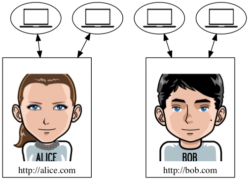
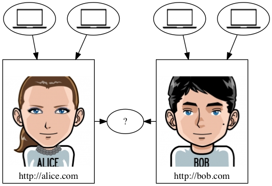
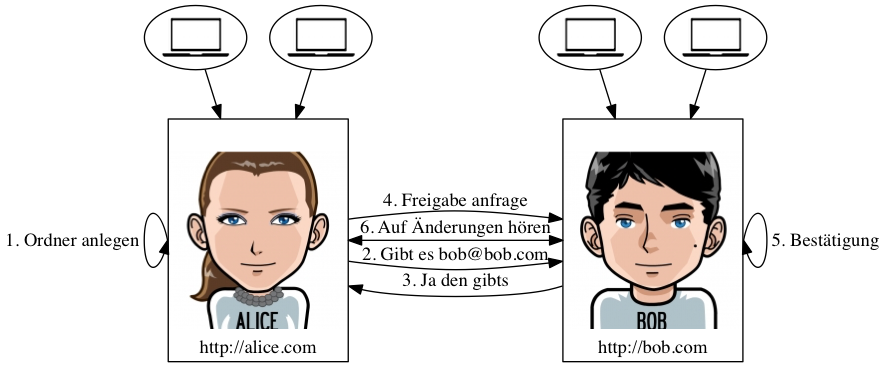

% symCloud
% Verteilte Filehosting- und Kollaborations- Plattform [https://github.com/symcloud](https://github.com/symcloud)
% <small>Erstellt von [Johannes Wachter](https://github.com/wachterjohannes) | [\@WachterJohannes](https://twitter.com/WachterJohannes)</small>

# Über mich

## me {.hide-header }

* Johannes Wachter
* FH Vorarlberg Master Informatik
* [MASSIVE ART WebServices GmbH](http://www.massiveart.com/de/)
* Web Developer [sulu.io](http://www.sulu.io/)

# Die Idee

## ownCloud

ownCloud is a self hosted file sync and share server. It provides access to your data
through a web interface, sync clients or WebDAV while providing a platform to view, sync
and share across devices easily—all under your control.

***

### Evaluierung und Entwicklung eines verteilten Speicherkonzeptes als Grundlage für eine Filehosting- und Kollaborations- Plattform

(working title)

# Szenario

## Personas

* Jurastudentin im 2. Semester
* Hauptfach Datenschutz

* Informatikstudent im 4. Semester
* Technikbegeistert

[Quellen der Bilder](http://wikis.zum.de/rmg/Benutzer:Deininger_Matthias/Facharbeit/Alice_Bob_und_Mallory)

## Ausgangspunkt

## Teilen

## Simpsons {.hide-header data-background=http://i.giphy.com/8EmeieJAGjvUI.gif}

## Ablauf

## Awesome {.hide-header data-background=http://i.giphy.com/9w9Bpoiddg72U.gif}

# Features

## Verteilung

* Kommunikation zwischen Servern
* Benutzerinteraktion

## Versionierung

* Änderung bewirkt neue Version
* Nachverfolgung und Wiederherstellung

## Datensicherheit

* Kontrollierbare Umgebung
* Schutz vor Fremdzugriff
* Ausfallsicherheit
* Replikationen auf vertrauenswürdigen Servern

# Zusammenfassung

# The End

## Links

* [sulu.io](http://www.sulu.io)
* [symCloud Github Organisation](https://github.com/symcloud)
