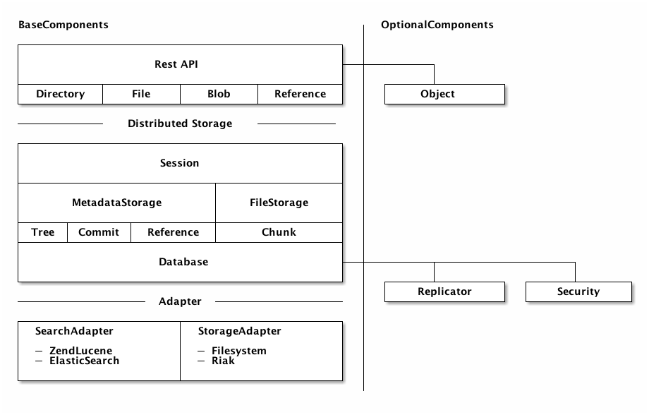
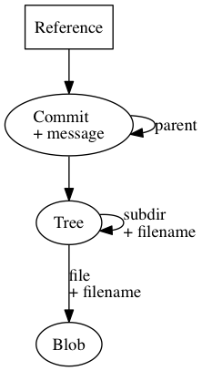
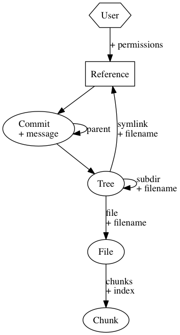
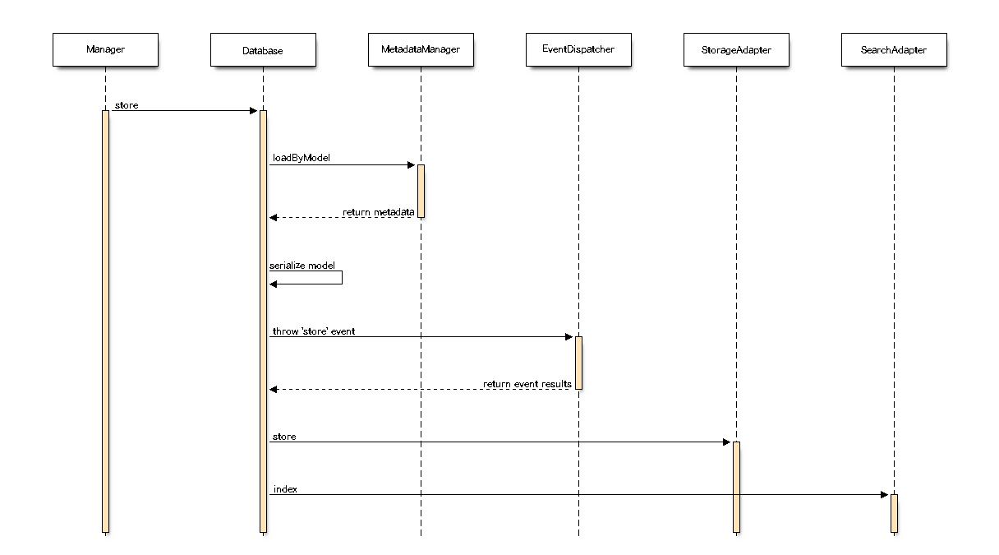
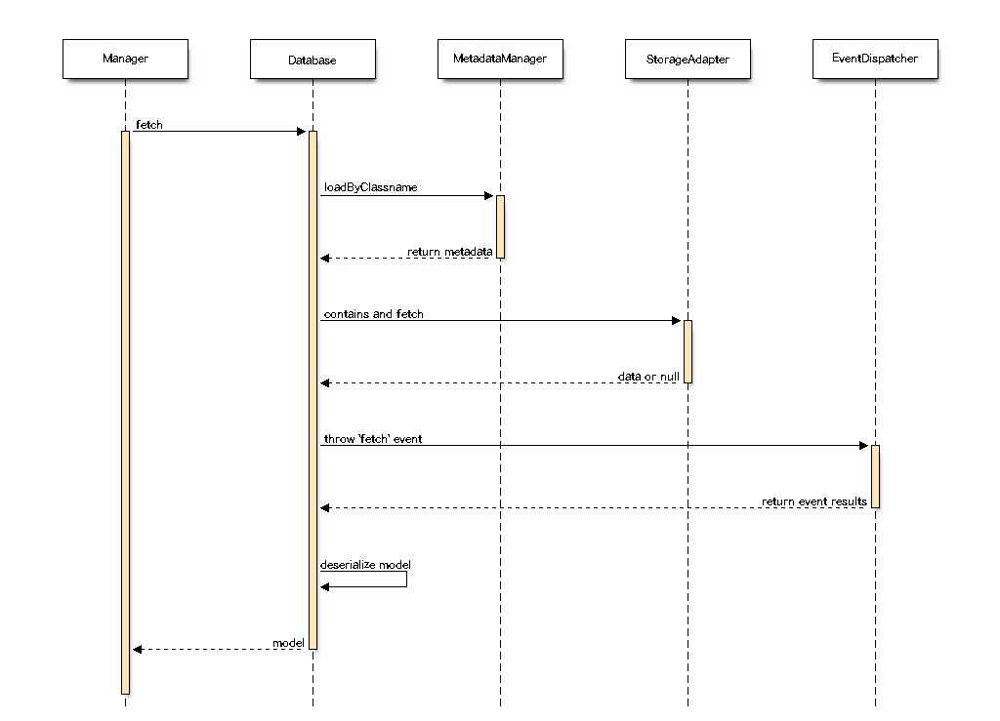
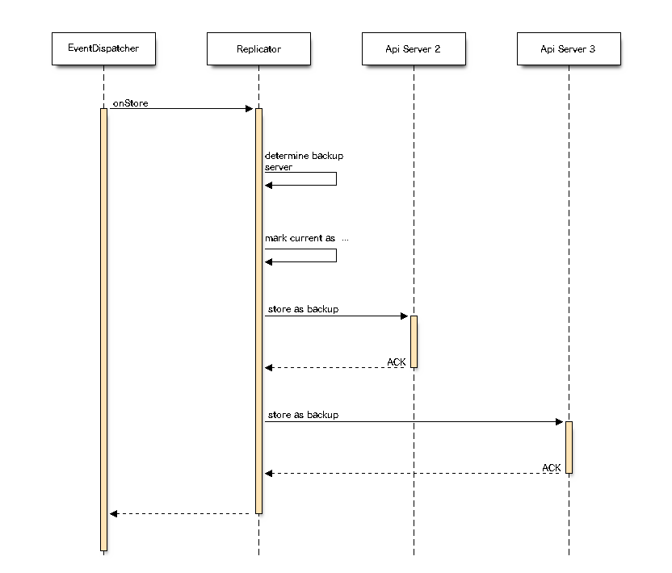
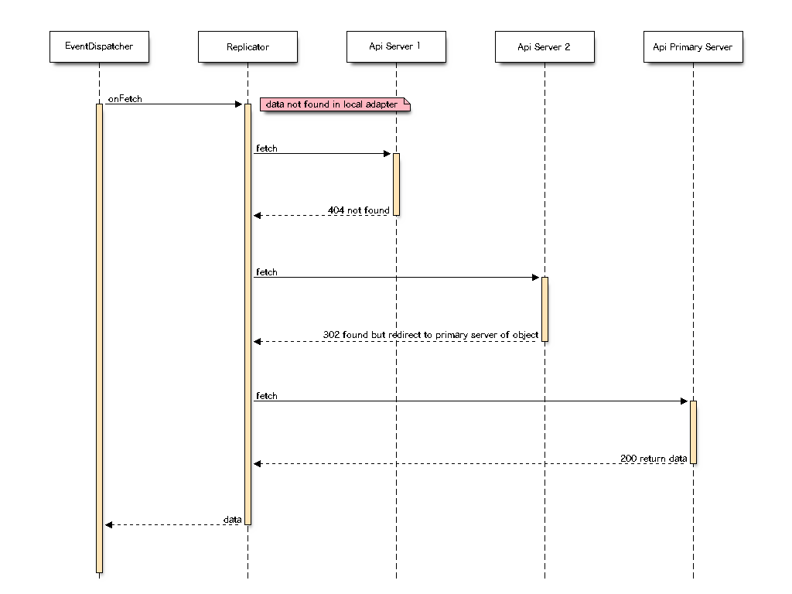
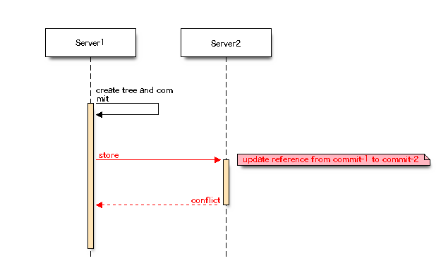

% symCloud
% Distributed File-Storage and Collaboration-Platform [https://github.com/symcloud](https://github.com/symcloud)
% <small>Erstellt von [Johannes Wachter](https://github.com/wachterjohannes) | [\@WachterJohannes](https://twitter.com/WachterJohannes)</small>

# Über das Projekt ... {#small .small}

***

initiiert 2014

als ein Thema für meine Masterarbeit ohne konkretes Ziel

## ownCloud

ownCloud is a self hosted file sync and share server. It provides access to your data
through a web interface, sync clients or WebDAV while providing a platform to view, sync
and share across devices easily—all under your control.

## awesome {.hide-header data-background=http://i.giphy.com/fO1c8eUlcx2bS.gif}

## Spezifikationen

* PHP & Symfony 2
* Versionierung
* Verteilung
* Teilen
* Sicher

# Inspiration

## Project Xanadu

* first hypertext project
* founded in 1960 by Ted Nelson

***

„HTML ist exakt was wir zu VERHINDERN versucht haben - ständig tote Links, Links die nur nach außen führen, Zitate, die man nicht zu ihren Ursprüngen zurückverfolgen kann, keine Versionsverwaltung, keine Rechteverwaltung.“

– Ted Nelson

## Features

* Transclusion
* Bidirektionale Links
* Micropayment
* Versionierung
* Redundanzen

#### Bestand aus 17 Thesen.

## Wichtige Thesen

* (2.) Every Xanadu server can be operated independently or in a network.
* (4.) Every user can search, retrieve, create and store documents.
* (12.) Every document can be rapidly searched, stored and retrieved without user knowledge of where it is physically stored.
* (13.) Every document is automatically stored redundantly to maintain availability even in case of a disaster.

## diaspora*

## Hard Facts

* open-source distributed social-network
* founded 2010 by:
    * Dan Grippi
    * Maxwell Salzberg
    * Raphael Sofaer
    * Ilya Zhitomirskiy (†2011)

***

## diaspora*

* Decentralization
* Freedom
* Privacy

### You Own Your Data

## awesome {.hide-header data-background=http://i.giphy.com/9w9Bpoiddg72U.gif}

# All in all

*** 

### Evaluierung und Entwicklung eines verteilten Speicherkonzeptes als Grundlage für eine Filehosting und Collaboration Platform

(working title)

***

Vision

### connect everything

## Mit silex

__TODO silex php example ?? live ??__

*** 

#### Open & Secure & Simple
### Filehosting Coudstorage
#### to connect them all

# Architecture

***

# Datenmodell

## GIT

Datenmodell basiert auf GIT

## GIT

* Hash-Value Datenbank
* Immutable Objekte
* Referenzen nicht in Datenbank

## symCloud

# Datenbank

## Store {.img-white}

## Fetch {.img-white}

## Replikator

* Erstellt Replikationen im Netzwerk
* Kümmert sich um Caching
* Lädt Daten von anderen Servern nach
* Implementiert ein Primärbasiertes Protokoll

## XtreemFS

* Inspiration bei der Replikation
* Primärbasiertes Protokoll

***

***

***

***

***

<small>Quelle [http://xtreemfs.org/how_replication_works.php](http://xtreemfs.org/how_replication_works.php)</small>

## symCloud

* Daten immer dort bearbeiten, wo sie erstellt wurden.
* Immutable Objekte werden nicht bearbeitet

## on Store {.img-white}

## on Fetch {.img-white}

## Konflikt {.img-white}

# Weitere Entwicklungen

## webfinger

WebFinger protocol can be used to discover information about people or other entities on
the Internet using standard HTTP methods.

[RFC-7033: WebFinger](https://tools.ietf.org/html/rfc7033)

## PubSubHubbub

An open, simple, web-scale and decentralized pubsub protocol. Anybody can play.

[PubSubHubbub Core 0.4 -- Working Draft](http://pubsubhubbub.github.io/PubSubHubbub/pubsubhubbub-core-0.4.html)

## Platform in SULU
   
* start __sharing__
* enable __editing__
* discover __others__

### bring all together

## Spezifikation

* für Transportlayer und Datenmodell
* unabhängig von Programmiersprache

# The End

## Links

* [Project Xanadu](http://xanadu.com/)
* [The Xanadu Dream](http://blog.codinghorror.com/the-xanadu-dream/)
* [The Curse of Xanadu](http://archive.wired.com/wired/archive//3.06/xanadu_pr.html)
* [Xanadu - Ein Wissens- und Informationssystem](http://fsub.schule.de/freie/1freie-index.htm?/freie/xanadu.htm)
* [How does diaspora* work?](https://diasporafoundation.org)
* [On Diaspora's Social Network, You Own Your Data](http://www.bloomberg.com/bw/articles/2012-05-10/on-diasporas-social-network-you-own-your-data)
* [XtreemFS - Under the Hood: File Replication](http://xtreemfs.org/how_replication_works.php)
