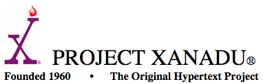

% symCloud
% Verteilte Filehosting- und Kollaborations- Plattform [https://github.com/symcloud](https://github.com/symcloud)
% <small>Erstellt von [Johannes Wachter](https://github.com/wachterjohannes) | [\@WachterJohannes](https://twitter.com/WachterJohannes)</small>

# Über mich
 
## Me {#me .hide-header}

* Johannes Wachter
* FH Vorarlberg Master Informatik
* [MASSIVE ART WebServices GmbH](http://www.massiveart.com/de/)
* Web Developer [sulu.io](http://www.sulu.io/)

# Agenda

***

* Motivation
* Ziele
* Resultat
* Implementierung
* Ausblick

# Motivation

***

</small>](img/filehosting_provider.jpg)

***

</small>](img/snowden_tag_cloud.png)

# Einführung

## ownCloud {.hide-header}

## Project Xanadu {.hide-header}

## Project Xanadu {.hide-header}

__TODO evtl Thesen ...__

## Diaspora {.hide-header}

# Ziele und Anforderungen

## Ziele

TODO Ziele

## Anforderungen

1. Datensicherheit
2. Filehosting und -sharing Funktionalitäten
3. Architektur

# Resultate

## Evaluierung

TODO Resultate

## Konzept

# Implementierung

## Technology

## Bibliothek - distributed storage {.smaller-title}

## Plattform - symCloud {.smaller-title}

## Synchronisierung - jibe {.smaller-title}

# Fazit

*** 

__TODO Fazit__ 

# END

***

</small>](img/symcloud-tag-cloud.png)
