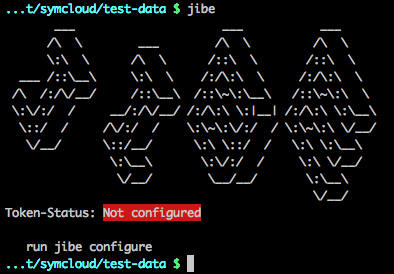

% symCloud
% Verteilte Filehosting- und Kollaborations- Plattform [https://github.com/symcloud](https://github.com/symcloud)
% <small>Erstellt von [Johannes Wachter](https://github.com/wachterjohannes) | [\@WachterJohannes](https://twitter.com/WachterJohannes)</small>

# Über mich
 
## Me {#me .hide-header}

* Johannes Wachter
* FH Vorarlberg Master Informatik
* [MASSIVE ART WebServices GmbH](http://www.massiveart.com/de/)
* Web Developer [sulu.io](http://www.sulu.io/)

# Agenda

***

* Motivation
* Ziele
* Resultat
* Implementierung
* Ausblick

# Motivation

***

</small>](img/filehosting_provider.jpg)

***

</small>](img/snowden_tag_cloud.png)

# Einführung

## ownCloud {.hide-header}

* Quellofenes Filehosting Portal
* Alternative zu kommerziellen Betreibern

## Kolaboration {.hide-header}

## Project Xanadu {.hide-header}

* Theodor Holm Nelson 
  <small>Philosoph und Informationstechnikpionier</small>
* 1960 - ?

## Project Xanadu {.hide-header}

1. Every Xanadu server can be operated independently or in a network.
2. Every user is uniquely and securely identified.
3. Every user can search, retrieve, create and store documents.
4. Every document can have secure access controls.
5. Every document can be rapidly searched, stored and retrieved without user know- ledge of where it is physically stored.
6. Every document is automatically stored redundantly to maintain availability even in case of a disaster.

## Diaspora {.hide-header}

* Dezantrales soziales Netzwerk
* Serverübergreifende Komunikation

# Ziele und Anforderungen

## Ziele

* Konzept für Datenhaltung
* Prototyp

## Anforderungen

1. Datensicherheit
2. Filehosting und -sharing Funktionalitäten
3. Architektur

# Resultate

## Evaluierung

* Verteilte Daten - Diaspora
* Verteilte Datenmodelle - GIT
* Objekt - Speicherdienste
* Verteilte Dateisysteme - NFS und XtreemFS
* Datenbankgestützte Dateiverwaltung - GridFS

## Konzept

__TODO Kombination der Technologien darstellen__ 

# Implementierung

## Technology

## Bibliothek - distributed storage {.smaller-title}

## Plattform - symCloud {.smaller-title #platform}

## Synchronisierung - jibe {.smaller-title}

# Fazit und Probleme

## Probleme 

* Immutable - unveränderbare Objkte
* Performance Verteilungsprotokoll

## Fazit

__TODO Fazit__

# END

***

</small>](img/symcloud-tag-cloud.png)
